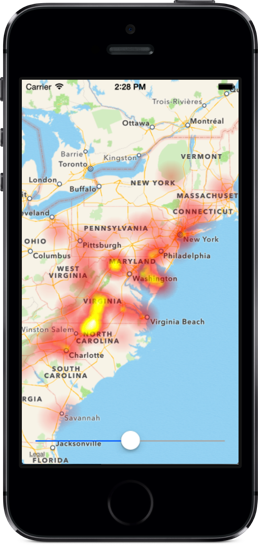

# .NET LFHeatMap

.NET and Xamarin port of [LFHEATMAP iOS](https://github.com/gpolak/LFHeatMap) heat map package



## Features
* extremely fast heat map generation from point/weight data pairs
* generates byte[]  of RGBA images that can be used as needed
* variable boost/bleed
* portable class library

## Adding LFHeatMap to Your Project

### NUGET

```console
Install-Package LFHeatMap
```

### Source Files

Alternatively you can directly add the `LFHeatMap.iOS` project to your own project or  `LFHeatMap` portable class library.

## Demo - iOS
This demo plots the measured magnitudes of the [2011 Virginia Earthquake](http://en.wikipedia.org/wiki/2011_Virginia_earthquake).

### Running
1. Open and launch the LFHeatMapDemo project in VS or XS. 
2. Move the slider on the bottom to adjust the boost.

## LFHeatMap

This class contains the three basic static functions used to generate the heat maps.

### 1. Basic Heat Map

Supply the desired image dimensions and boost, as well as the point/value arrays. There should be a 1:1 mapping between these two arrays, that is each index in the *points* array should have a corresponding index in the *weights* array. Alternate you can also provide a PointWithWeight array.

### 2. Advanced Heat Map

Works generally the same as the basic heat map, but allows to tweak two additional parameters to control the "bleed" of heat rendering.

### 3. MKMapView Helper

Works the same as the basic heat map, but allows you to supply map-specific parameters. Pass an `MKMapView` object (typically the target you want to overlay), and an array of `CLLocation` objects corresponding to coordinates on the specified `MKMapView` object.

The function will convert these to the required CGRect/CGPoint values as needed.


## License

LFHeatMap is available under the MIT license. See the LICENSE file for more info.


## LF?

LFHeatMap comes from the work of [George Polak](https://github.com/gpolak) here, and was ported to .NET and Xamarin by [Rui Marinho](https://github.com/rmarinho).
